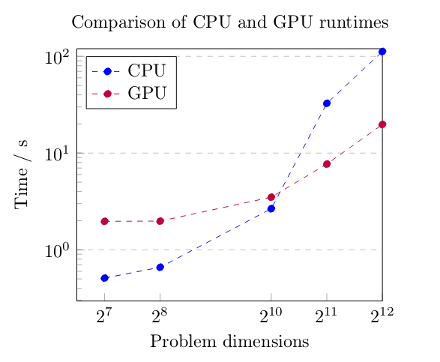

# LBM for multi node CPU and GPU systems

A D2Q9-BGK LBM solver written in two versions. One optimized for multi node
systems with several multi-core CPUs with a distributed memory model and the
other optimized for heterogeneous computing on a multi node system with GPU
accelerators using OpenCL kernels.

Written as part of the University of Bristol's COMS30006 Advanced High
Performance Computing unit, based on the skeleton provided in
[UoB-HPC/advanced-hpc-lbm](https://github.com/UoB-HPC/advanced-hpc-lbm).

## Description

The two versions of the code can be found in this repository as `CPU-lbm.c` and
`GPU-lbm.c` with associated kernel file `kernels.cl`. A report on the
optimisations considered and used can be found in `report.pdf`.

The CPU version uses MPI to communicate between cores and nodes and a vectorised
collision loop to calculate the flow. It is optimised for multiples of 14 cores
up to 112. Extensive serial optimisations were also made such that it runs 5.4
times faster than the supplied serial code.

The GPU version uses MPI to communicate between threads which each have a GPU
accelerator attached on which they run an optimised kernel to compute the LBM.
The program has been optimised on four threads accross 2 nodes each thread
having a NVIDIA Tesla P100.

## Results

The results of running the CPU version on four nodes each with two Intel E5-2680
v4 CPUs and the GPU version on two nodes each with two NVIDIA P100 Tesla GPUs.



### Running

The programs were run with a SLURM scheduler using the following commands:

#### CPU version

```
mpirun -ppn 112 -np 112 ./CPU-lbm input obstacles
```

#### GPU version

```
mpirun -l -ppn 1 -env CUDA_VISIBLE_DEVICES 0 ./GPU-lbm input obstacles : -env CUDA_VISIBLE_DEVICES 1 ./GPU-lbm input obstacles
```

#### Input and Obstacles

The input file should be a file just containing the following lines:

```
X-dimension
Y-dimension
max no. of iterations
reynolds dimension
density
acceleration
omega
```

The obstacle file should be a file with a line for each solid cell e.g. for
obstacles at cells (12, 0) and (0, 37) the file should contain:

```
12 0 1
0 37 1
```
